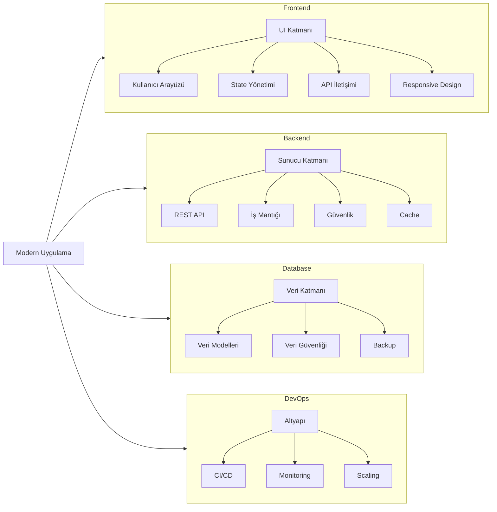

# Yazılım Geliştirici Olma Yolculuğu

[Kaynak](https://www.thoughtworks.com/en-us/insights/blog/experience-design/approaches-for-a-better-developer-experience)

## Temel Bilgi ve Beceriler
- **Algoritma ve Mantıksal Düşünme**: Programlamanın temelidir; bir problemi çözmek için adım adım talimatlar oluşturma, veri tipleri ve değişkenlerle çalışma, döngüler ve koşullu ifadeler kullanma, ve hata yönetimi gibi temel becerileri kapsar.

- **Veri Yapıları**: Verilerin bilgisayar belleğinde nasıl organize edildiğini ve yönetildiğini anlatan temel yapılardır. Diziler, bağlı listeler, ağaçlar ve hash tablolar gibi yapılar, farklı senaryolarda verimli veri yönetimi sağlar.

- **Nesne Yönelimli Programlama (OOP)**: Yazılımı, gerçek dünyadaki nesnelere benzer şekilde modelleyen bir paradigmadır. Sınıflar, nesneler, kalıtım, kapsülleme ve polimorfizm gibi kavramlarla kodun yeniden kullanılabilirliğini ve bakımını kolaylaştırır.

- **Versiyon Kontrol (Git)**: Yazılım geliştirme sürecinde kod değişikliklerini takip etmeyi, farklı versiyonları yönetmeyi ve takım çalışmasını kolaylaştıran sistemdir. Branch'ler, commit'ler ve merge işlemleri ile projenin tarihçesini yönetir.

- **Terminal Kullanımı**: Komut satırı arayüzü üzerinden sistem yönetimi ve geliştirme araçlarının kullanımını sağlar. Dosya sistemi işlemleri, paket yönetimi ve script çalıştırma gibi temel işlemleri hızlıca gerçekleştirmenize olanak tanır.

## Yazılım Mimarisi
- **Tasarım Desenleri**: Yazılım geliştirmede sık karşılaşılan problemlere getirilmiş, test edilmiş ve kanıtlanmış çözüm şablonlarıdır. Creational, Structural ve Behavioral olmak üzere üç ana kategoride toplanır ve kod organizasyonunu iyileştirir.

- **SOLID Prensipleri**: Yazılımın bakımını, esnekliğini ve anlaşılabilirliğini artıran beş temel tasarım prensibidir. Single Responsibility'den Dependency Inversion'a kadar her prensip, kodun kalitesini artırmaya yönelik rehberlik sağlar.

- **Clean Code**: Okunabilir, bakımı kolay ve anlaşılır kod yazma sanatıdır. Anlamlı isimlendirme, küçük fonksiyonlar, düzenli yorumlar ve kod tekrarını önleme gibi pratiklerle daha kaliteli yazılımlar geliştirmeyi hedefler.

- **Yazılım Yaşam Döngüsü**: Bir yazılımın fikir aşamasından bakım sürecine kadar geçirdiği tüm aşamaları kapsayan döngüdür. Analiz, tasarım, geliştirme, test ve deployment süreçlerini içerir.

## Veritabanı Yönetimi
- **İlişkisel Veritabanları**: Verilerin tablolar halinde ve birbiriyle ilişkili şekilde saklandığı sistemlerdir. SQL dili ile sorgulanır, normalize edilmiş veri yapısı ve ACID özellikleri ile veri bütünlüğünü garanti eder.

- **NoSQL Veritabanları**: İlişkisel olmayan, esnek şema yapısına sahip veritabanı sistemleridir. Yüksek ölçeklenebilirlik ve performans gerektiren senaryolarda tercih edilir, farklı veri modellerini (döküman, anahtar-değer, sütun-tabanlı, graf) destekler.

- **Veritabanı Tasarımı**: Verilerin etkili şekilde saklanması ve erişilmesi için yapılan planlamadır. Şema tasarımı, indeksleme stratejileri, performans optimizasyonu ve yedekleme politikalarını içerir.

## Modern Bir Uygulamanın Anatomisi

## Frontend Geliştirme
- **Temel Web Teknolojileri**: Modern web uygulamalarının yapı taşları olan HTML (içerik), CSS (stil) ve JavaScript (etkileşim) teknolojilerini kapsar. Semantik markup, responsive tasarım ve modern JavaScript özellikleri bu kategorinin temelini oluşturur.

- **UI/UX Prensipleri**: Kullanıcı deneyimini optimize etmeye yönelik tasarım prensipleridir. Kullanılabilirlik, erişilebilirlik, görsel hiyerarşi ve kullanıcı davranışlarını anlama gibi konuları içerir.

- **State Yönetimi**: Uygulama durumunun (state) etkili bir şekilde yönetilmesini sağlayan yaklaşımlardır. Yerel state, global state, caching ve veri akışı yönetimi gibi konuları kapsar.

- **Modern Framework'ler**: Flutter, React, Vue gibi modern uygulama geliştirme çatılarıdır. Komponent tabanlı geliştirme, sanal DOM, state yönetimi ve performans optimizasyonu gibi özellikleri içerir.

## Backend Entegrasyonu
- **API Tasarımı**: İstemci ve sunucu arasındaki iletişimi sağlayan arayüzlerin tasarımıdır. REST, GraphQL gibi farklı yaklaşımları, endpoint tasarımını, veri formatlarını ve güvenlik protokollerini içerir.

- **Veri İşleme**: Sunucu tarafında verilerin alınması, işlenmesi ve depolanması süreçlerini kapsar. CRUD operasyonları, veri doğrulama, hata yönetimi ve loglama gibi temel işlemleri içerir.

- **Güvenlik**: Uygulamanın ve verilerin korunmasını sağlayan önlemlerdir. Kimlik doğrulama, yetkilendirme, veri şifreleme ve güvenli iletişim protokolleri gibi konuları kapsar.

## Modern Uygulama Geliştirme Süreçleri
- **Agile Metodolojiler**: Esnek ve iteratif yazılım geliştirme yaklaşımıdır. Sprint planlaması, daily stand-up'lar, retrospektifler ve sürekli iyileştirme pratiklerini içerir.

- **DevOps Kültürü**: Geliştirme ve operasyon süreçlerinin entegrasyonunu sağlayan yaklaşımdır. CI/CD pipeline'ları, konteynerizasyon, cloud servisleri ve monitoring sistemlerini kapsar.

- **Test ve Kalite**: Yazılımın kalitesini garanti altına alan süreçlerdir. Unit testler, integration testler, UI testleri ve performans testleri gibi farklı test seviyelerini içerir. 