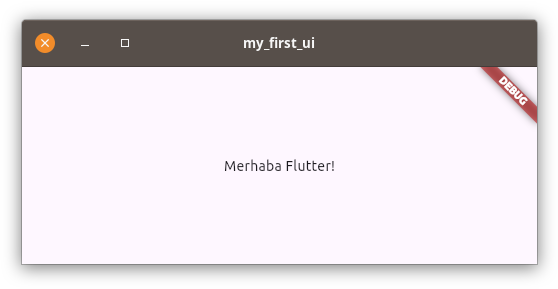
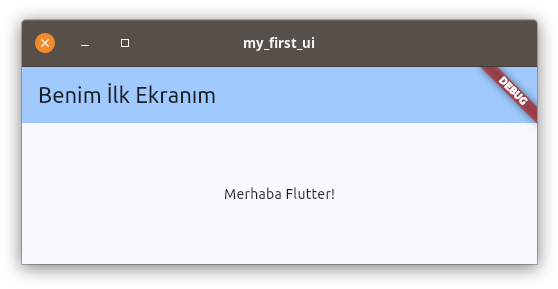
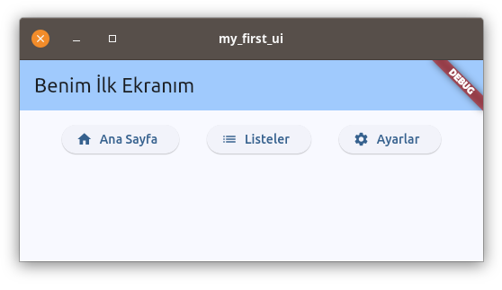
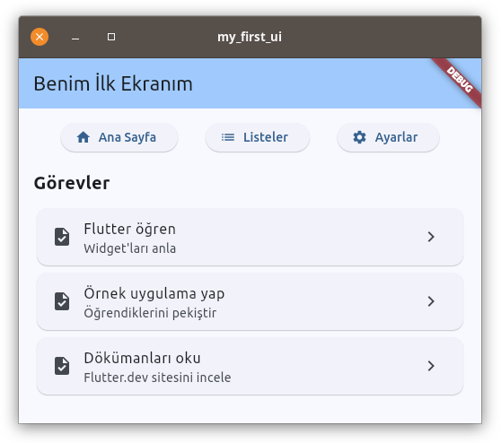

# Temel UI Tasarımı - Adım Adım

Bu bölümde, Flutter'da temel bir kullanıcı arayüzü tasarlamayı öğreneceğiz. Hiçbir etkileşim olmadan, sadece görsel öğeleri yerleştirmeye odaklanacağız.

## 1. Boş Proje Oluşturma

Öncelikle yeni bir Flutter projesi oluşturalım:

```bash
flutter create my_first_ui
cd my_first_ui
```

## 2. Ana Dosya İncelemesi (lib/main.dart)

Projemiz oluştuğunda, `lib/main.dart` dosyası otomatik olarak oluşturulur. Bu dosyanın içeriğini aşağıdaki kodlarla değiştirelim:

```dart
import 'package:flutter/material.dart';

void main() {
  runApp(const MainApp());
}

class MainApp extends StatelessWidget {
  const MainApp({super.key});

  @override
  Widget build(BuildContext context) {
    return const MaterialApp(
      home: Scaffold(
        body: Center(
          child: Text('Merhaba Flutter!'),
        ),
      ),
    );
  }
}
```

**Kodun Açıklaması:**
- `import 'package:flutter/material.dart'`: Flutter'ın temel widget'larını içeren material kütüphanesini içe aktarır
- `void main()`: Uygulamanın başlangıç noktasıdır
- `runApp()`: Flutter uygulamasını başlatan fonksiyondur
- `MainApp`: Uygulamanın kök widget'ıdır (StatelessWidget'tan türer)
- `build()`: Widget'ın nasıl görüneceğini tanımlayan metottur
- `MaterialApp`: Material Design temasını uygulayan widget
- `Scaffold`: Temel sayfa yapısını sağlayan widget
- `Center`: İçeriğini ortaya hizalayan widget
- `Text`: Metin gösteren widget

`lib/main.dart` dosyasında yukarıdaki değişikliği yaptıktan sonra aşağıdaki komutları sıra ile çalıştırın:

```bash
flutter clean
flutter pub get
flutter run
```
Buraya kadar yaptıklarımızla projemiz aşağıdaki gibi görünecektir:



Bu basit yapı, ekranın ortasında "Merhaba Flutter!" yazan boş bir sayfa gösterir. Şimdi bu yapıyı adım adım geliştireceğiz.

## 3. AppBar Ekleme

Şimdir `Scaffold` kelimesinin üzerindeykek `Ctrl + .` kısayolunu kullanarak açılan menüden `Extract Widget` seçeneğini seçerek `Scaffold` widget'ını genişletiyoruz. Bu aşamada bizden bir isim isteyecektir. Bu ismi `HomeScreen` olarak belirleyelim.

`lib/main.dart` dosyasında `HomeScreen` widget'ını oluşturduktan sonra aşağıdaki eklemeleri de yaparak dosyayı güncelleyelim:

```dart
import 'package:flutter/material.dart';

void main() {
  runApp(const MainApp());
}

class MainApp extends StatelessWidget {
  const MainApp({super.key});

  @override
  Widget build(BuildContext context) {
    return MaterialApp(   // ← Buradan const ifadesini kaldırın
      // ↓ Başlık ve Tema ayarları için aşağıdaki satırı ekleyin
      title: 'İlk UI Tasarımım',
      theme: ThemeData(
        colorScheme: ColorScheme.fromSeed(seedColor: Colors.blue),
        useMaterial3: true,
      ),
      // -----------------
      home: const HomeScreen(),  // ← Buraya const ifadesini ekleyin
    );
  }
}

class HomeScreen extends StatelessWidget {
  const HomeScreen({
    super.key,
  });

  @override
  Widget build(BuildContext context) {
    return Scaffold(
      // ↓ Buraya AppBar ekleyin
      appBar: AppBar(
        title: const Text('Benim İlk Ekranım'),
        backgroundColor: Theme.of(context).colorScheme.inversePrimary,
      ),
      // -----------------
      body: Center(
        child: Text('Merhaba Flutter!'),
      ),
    );
  }
}
```

Projeyi kapatmadıysanız `Ctrl + s` ile dosyayı kaydedin ve terminal penceresini tıklayarak `r` ile `Hot reload  🔥🔥🔥` yapın. Projeniz aşağıdaki gibi görünecektir:



## 4. Buton Satırı Ekleme

Şimdi AppBar'ın altına yan yana butonlar ekleyelim:

```dart
class HomeScreen extends StatelessWidget {
  const HomeScreen({super.key});

  @override
  Widget build(BuildContext context) {
    return Scaffold(
      appBar: AppBar(
        title: const Text('Benim İlk Ekranım'),
        backgroundColor: Theme.of(context).colorScheme.inversePrimary,
      ),
      body: Padding(      // ← Buradaki Center ifadesini Padding ile değiştirin
        child: Text('Merhaba Flutter!'), // ← Bu satırı silin
        // ↓ Aşağıdaki satırları ekleyin
        padding: const EdgeInsets.all(16.0),
        child: Column(
          children: [
            // Buton Satırı
            Row(
              mainAxisAlignment: MainAxisAlignment.spaceEvenly,
              children: [
                ElevatedButton.icon(
                  onPressed: () {},
                  icon: const Icon(Icons.home),
                  label: const Text('Ana Sayfa'),
                ),
                ElevatedButton.icon(
                  onPressed: () {},
                  icon: const Icon(Icons.list),
                  label: const Text('Listeler'),
                ),
                ElevatedButton.icon(
                  onPressed: () {},
                  icon: const Icon(Icons.settings),
                  label: const Text('Ayarlar'),
                ),
              ],
            ),
          ],
        ),
        // -----------------
      ),
    );
  }
}
```

Projeyi kapatmadıysanız `Ctrl + s` ile dosyayı kaydedin ve terminal penceresini tıklayarak `r` ile `Hot reload  🔥🔥🔥` yapın. Projeniz aşağıdaki gibi görünecektir:



## 5. Görev Listesi Ekleme

Şimdi de düğmelerin altına statik bir görev listesi ekleyelim:

```dart
body: Padding(
  padding: const EdgeInsets.all(16.0),
  child: Column(
    children: [
      // ... Önceki widget'lar ...
      
      const SizedBox(height: 20),
      
      // Görev Listesi Başlığı
      const Row(
        children: [
          Text(
            'Görevler',
            style: TextStyle(
              fontSize: 20,
              fontWeight: FontWeight.bold,
            ),
          ),
        ],
      ),
      
      const SizedBox(height: 10),
      
      // Görev Listesi
      Expanded(
        child: ListView(
          children: const [
            Card(
              child: ListTile(
                leading: Icon(Icons.task),
                title: Text('Flutter öğren'),
                subtitle: Text('Widget\'ları anla'),
                trailing: Icon(Icons.chevron_right),
              ),
            ),
            Card(
              child: ListTile(
                leading: Icon(Icons.task),
                title: Text('Örnek uygulama yap'),
                subtitle: Text('Öğrendiklerini pekiştir'),
                trailing: Icon(Icons.chevron_right),
              ),
            ),
            Card(
              child: ListTile(
                leading: Icon(Icons.task),
                title: Text('Dökümanları oku'),
                subtitle: Text('Flutter.dev sitesini incele'),
                trailing: Icon(Icons.chevron_right),
              ),
            ),
          ],
        ),
      ),
    ],
  ),
),
```

Projeyi kapatmadıysanız `Ctrl + s` ile dosyayı kaydedin ve terminal penceresini tıklayarak `r` ile `Hot reload  🔥🔥🔥` yapın. Projeniz aşağıdaki gibi görünecektir:



## Öğrendiklerimiz

Bu basit UI tasarımı ile şu widget'ları kullanmayı öğrendik:

1. **Temel Layout Widget'ları**
   - Scaffold: Temel sayfa yapısı
   - AppBar: Üst menü çubuğu
   - Column: Dikey düzenleme
   - Row: Yatay düzenleme
   - Padding: Kenar boşlukları
   - SizedBox: Boşluk oluşturma
   - Expanded: Kalan alanı doldurma

2. **UI Bileşenleri**
   - Text: Metin gösterimi
   - ElevatedButton: Düğmeler
   - Card: Kartlar
   - ListTile: Liste öğeleri
   - Icon: İkonlar

3. **Stil ve Düzen**
   - mainAxisAlignment: Ana eksen hizalama
   - padding: İç boşluk
   - TextStyle: Metin stilleri
   - Colors: Renk kullanımı

## Sonraki Adımlar

Bu temel tasarımı geliştirmek için:

1. Farklı buton tipleri kullanabilirsiniz (OutlinedButton, TextButton)
2. Görev kartlarına farklı renkler ekleyebilirsiniz
3. Kartlara gölge ve köşe yuvarlaması ekleyebilirsiniz
4. Farklı ikon ve yazı tipleri deneyebilirsiniz
5. Tema özelleştirmesi yapabilirsiniz 