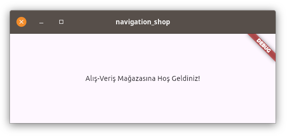
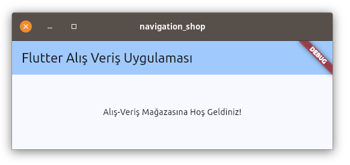
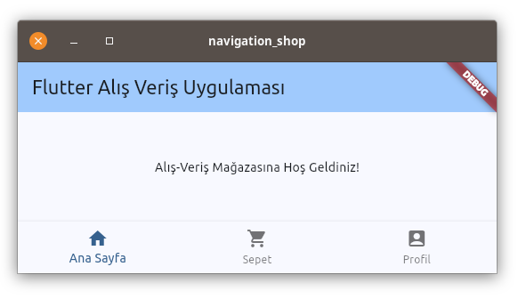
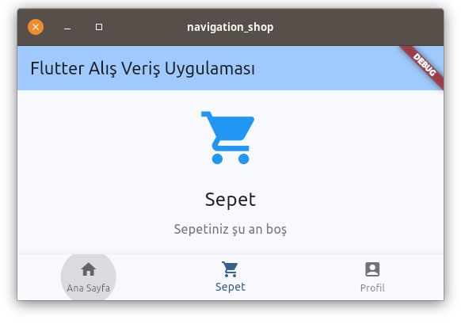
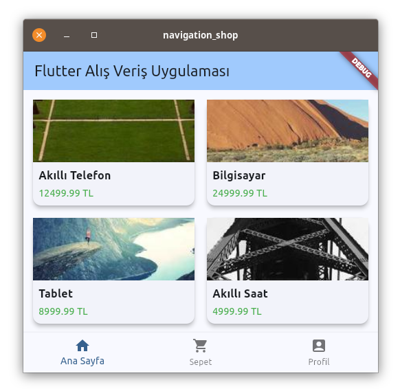

#  Flutter Navigation Projesi - Adım Adım

Bu bölümde, öğrendiğimiz navigasyon konularını kullanarak basit bir e-ticaret uygulaması yapacağız.

## 1. Proje Oluşturma

Öncelikle yeni bir Flutter projesi oluşturalım:

```bash
flutter create navigation_shop
cd navigation_shop
```

## 2. Proje Yapısı

Projemizde aşağıdaki sayfalar olacak:
- Ana Sayfa (Ürün Listesi)
- Ürün Detay Sayfası
- Sepet Sayfası
- Profil Sayfası


## 3. Ana Dosya İncelemesi (lib/main.dart)

Projemiz oluştuğunda, `lib/main.dart` dosyası otomatik olarak oluşturulur. Bu dosyanın içeriğini aşağıdaki kodlarla değiştirelim:

```dart
import 'package:flutter/material.dart';

void main() {
  runApp(const MainApp());
}

class MainApp extends StatelessWidget {
  const MainApp({super.key});

  @override
  Widget build(BuildContext context) {
    return const MaterialApp(
      home: Scaffold(
        body: Center(
          child: Text('Alış-Veriş Mağazasına Hoş Geldiniz!'),
        ),
      ),
    );
  }
}
```

**Kodun Açıklaması:**
- `import 'package:flutter/material.dart'`: Flutter'ın temel widget'larını içeren material kütüphanesini içe aktarır
- `void main()`: Uygulamanın başlangıç noktasıdır
- `runApp()`: Flutter uygulamasını başlatan fonksiyondur
- `MainApp`: Uygulamanın kök widget'ıdır (StatelessWidget'tan türer)
- `build()`: Widget'ın nasıl görüneceğini tanımlayan metottur
- `MaterialApp`: Material Design temasını uygulayan widget
- `Scaffold`: Temel sayfa yapısını sağlayan widget
- `Center`: İçeriğini ortaya hizalayan widget
- `Text`: Metin gösteren widget

`lib/main.dart` dosyasında yukarıdaki değişikliği yaptıktan sonra aşağıdaki komutları sıra ile çalıştırın:

```bash
flutter clean
flutter pub get
flutter run
```
Buraya kadar yaptıklarımızla projemiz aşağıdaki gibi görünecektir:



Bu basit yapı, ekranın ortasında "Alış-Veriş Mağazasına Hoş Geldiniz" yazan boş bir sayfa gösterir. Şimdi bu yapıyı adım adım geliştirerek proje yapacagız.

## 4. AppBar Ekleme

Şimdir `Scaffold` kelimesinin üzerindeykek `Ctrl + .` kısayolunu kullanarak açılan menüden `Extract Widget` seçeneğini seçerek `Scaffold` widget'ını genişletiyoruz. Bu aşamada bizden bir isim isteyecektir. Bu ismi `AnaEkran` olarak belirleyelim.

`lib/main.dart` dosyasında `AnaEkran` widget'ını oluşturduktan sonra aşağıdaki eklemeleri de yaparak dosyayı güncelleyelim:

```dart
import 'package:flutter/material.dart';

void main() {
  runApp(const MainApp());
}

class MainApp extends StatelessWidget {
  const MainApp({super.key});

  @override
  Widget build(BuildContext context) {
    return MaterialApp(   // ← Buradan const ifadesini kaldırın
      // ↓ Başlık ve Tema ayarları için aşağıdaki satırı ekleyin
      title: 'Flutter Navigation',
      theme: ThemeData(
        colorScheme: ColorScheme.fromSeed(seedColor: Colors.blue),
        useMaterial3: true,
      ),
      // -----------------
      home: const AnaEkran(),  // ← Buraya const ifadesini ekleyin
    );
  }
}

class AnaEkran extends StatelessWidget {
  const AnaEkran({
    super.key,
  });

  @override
  Widget build(BuildContext context) {
    return Scaffold(
      // ↓ Buraya AppBar ekleyin
      appBar: AppBar(
        title: const Text('Flutter Alış Veriş Uygulaması'),
        backgroundColor: Theme.of(context).colorScheme.inversePrimary,
      ),
      // -----------------
      body: Center(
        child: Text('Alış-Veriş Mağazasına Hoş Geldiniz'),
      ),
    );
  }
}
```

**Kodun Açıklaması:**
- `import 'package:flutter/material.dart'`: Flutter'ın temel widget'larını içeren material kütüphanesini içe aktarır
- `void main()`: Uygulamanın başlangıç noktasıdır
- `runApp()`: Flutter uygulamasını başlatan fonksiyondur
- `MainApp`: Uygulamanın kök widget'ıdır (StatelessWidget'tan türer)
- `build()`: Widget'ın nasıl görüneceğini tanımlayan metottur
- `MaterialApp`: Material Design temasını uygulayan widget
- `Scaffold`: Temel sayfa yapısını sağlayan widget
- `Center`: İçeriğini ortaya hizalayan widget
- `Text`: Metin gösteren widget

Projeyi kapatmadıysanız `Ctrl + s` ile dosyayı kaydedin ve terminal penceresini tıklayarak `r` ile `Hot reload  🔥🔥🔥` yapın. Projeniz aşağıdaki gibi görünecektir:




## 5. BottomNavigationBar Ekleme

Şimdi uygulamamıza alt navigasyon çubuğu ekleyeceğiz. Bu çubuk sayesinde kullanıcılar ana sayfa, sepet ve profil sayfaları arasında kolayca geçiş yapabilecekler. `AnaEkran` widget'ını `StatefulWidget`'a dönüştürerek başlayalım, çükü seçili sekmeyi takip etmemiz gerekecek.

Bunun için `class AnaEkran extends StatelessWidget {` satırındaki `AnaEkran` ifadesine tıklayıp `Ctrl + .` kısayolunu kullanarak `Convert to StatefulWidget` seçeneğini seçerek `StatefulWidget`'a dönüştürelim.

`lib/main.dart` dosyasını aşağıdaki gibi güncelleyelim:

```dart
import 'package:flutter/material.dart';

void main() {
  runApp(const MainApp());
}

class MainApp extends StatelessWidget {
  const MainApp({super.key});

  @override
  Widget build(BuildContext context) {
    return MaterialApp(
      title: 'Flutter Navigation',
      theme: ThemeData(
        colorScheme: ColorScheme.fromSeed(seedColor: Colors.blue),
        useMaterial3: true,
      ),
      home: const AnaEkran(),
    );
  }
}

class AnaEkran extends StatefulWidget {
  const AnaEkran({super.key});

  @override
  State<AnaEkran> createState() => _AnaEkranState();
}

class _AnaEkranState extends State<AnaEkran> {
  // Burada _selectedIndex değişkeni tanımladık. Başlangıçta 0 olması Ana Sayfanın görünmesini sağlıyor.
  int _selectedIndex = 0;

  @override
  Widget build(BuildContext context) {
    return Scaffold(
      appBar: AppBar(
        title: const Text('Flutter Alış Veriş Uygulaması'),
        backgroundColor: Theme.of(context).colorScheme.inversePrimary,
      ),
      body: const Center(
        child: Text('Alış-Veriş Mağazasına Hoş Geldiniz'),
      ),
      // ↓ Buraya bottomNavigationBar ekleyerek navigasyonu oluşturuyoruz.
      bottomNavigationBar: BottomNavigationBar(
        items: const <BottomNavigationBarItem>[
          BottomNavigationBarItem(
            icon: Icon(Icons.home),
            label: 'Ana Sayfa',
          ),
          BottomNavigationBarItem(
            icon: Icon(Icons.shopping_cart),
            label: 'Sepet',
          ),
          BottomNavigationBarItem(
            icon: Icon(Icons.account_box),
            label: 'Profil',
          ),
        ],
        // ↓ Buraya _selectedIndex değişkenini ekleyin
        currentIndex: _selectedIndex,
        // ↓ Buraya onTap olayı ekleyin, her bir düğmeye tıklayınca _selectedIndex değişkeninin değeri değişmiş olacak.
        onTap: (index) {
          setState(() {
            _selectedIndex = index;
          });
        },
      ),
    );
  }
}
```

**Yapılan Değişikliklerin Açıklaması:**
1. `AnaEkran` widget'ı `StatefulWidget`'a dönüştürüldü
2. `_selectedIndex` değişkeni eklendi (seçili sekmeyi takip etmek için)
3. `BottomNavigationBar` widget'ı eklendi ve üç sekme tanımlandı:
   - Ana Sayfa (home ikonu)
   - Sepet (shopping_cart ikonu)
   - Profil (account_box ikonu)
4. `onTap` olayı ile seçili sekme değiştiğinde state güncelleniyor

Bu aşamada `Hot reload   🔥🔥🔥` ile yeniden başlatınca uygulamamız aşağıdaki gibi görünecektir:



Şu an için sekmelere tıkladığımızda sadece alttaki çubukta seçili sekme değişiyor, henüz sayfa içeriği değişmiyor. Bir sonraki adımda her sekme için ayrı sayfalar oluşturup, sekme değiştiğinde ilgili sayfanın gösterilmesini sağlayacağız.

## 6. Sayfa Dosyalarının Oluşturulması

Şimdi projemizde kullanacağımız sayfaları oluşturalım. Öncelikle `lib` klasörü içinde `screens` adında bir klasör oluşturalım. Bu klasör içinde her bir sayfa için ayrı bir dart dosyası oluşturacağız.

1. İlk olarak `lib` klasörü içinde `screens` klasörünü oluşturun:
```bash
mkdir lib/screens
```

2. Şimdi sırasıyla üç sayfa dosyamızı oluşturalım:

**lib/screens/ana_sayfa.dart:**
```dart
import 'package:flutter/material.dart';

class AnaSayfa extends StatelessWidget {
  const AnaSayfa({super.key});

  @override
  Widget build(BuildContext context) {
    return Center(
      child: Column(
        mainAxisAlignment: MainAxisAlignment.center,
        children: [
          const Icon(
            Icons.home,
            size: 80,
            color: Colors.blue,
          ),
          const SizedBox(height: 20),
          const Text(
            'Ana Sayfa',
            style: TextStyle(fontSize: 24),
          ),
          const SizedBox(height: 10),
          Text(
            'Ürünlerimiz yakında burada listelenecek',
            style: TextStyle(
              fontSize: 16,
              color: Colors.grey[600],
            ),
          ),
        ],
      ),
    );
  }
}
```

**lib/screens/sepet.dart:**
```dart
import 'package:flutter/material.dart';

class Sepet extends StatelessWidget {
  const Sepet({super.key});

  @override
  Widget build(BuildContext context) {
    return Center(
      child: Column(
        mainAxisAlignment: MainAxisAlignment.center,
        children: [
          const Icon(
            Icons.shopping_cart,
            size: 80,
            color: Colors.blue,
          ),
          const SizedBox(height: 20),
          const Text(
            'Sepet',
            style: TextStyle(fontSize: 24),
          ),
          const SizedBox(height: 10),
          Text(
            'Sepetiniz şu an boş',
            style: TextStyle(
              fontSize: 16,
              color: Colors.grey[600],
            ),
          ),
        ],
      ),
    );
  }
}
```

**lib/screens/profil.dart:**
```dart
import 'package:flutter/material.dart';

class Profil extends StatelessWidget {
  const Profil({super.key});

  @override
  Widget build(BuildContext context) {
    return Center(
      child: Column(
        mainAxisAlignment: MainAxisAlignment.center,
        children: [
          const Icon(
            Icons.account_box,
            size: 80,
            color: Colors.blue,
          ),
          const SizedBox(height: 20),
          const Text(
            'Profil',
            style: TextStyle(fontSize: 24),
          ),
          const SizedBox(height: 10),
          Text(
            'Profil bilgileriniz burada görünecek',
            style: TextStyle(
              fontSize: 16,
              color: Colors.grey[600],
            ),
          ),
        ],
      ),
    );
  }
}
```

Her bir sayfa dosyası şu an için basit bir görünüme sahip:
- Sayfayı temsil eden büyük bir ikon
- Sayfa başlığı
- Açıklama metni

Şu an için her sayfa `StatelessWidget` olarak oluşturuldu çünkü henüz içlerinde değişken durum (state) tutmamıza gerek yok. İlerleyen aşamalarda gerekirse `StatefulWidget`'a dönüştürebiliriz.

Bir sonraki adımda `main.dart` dosyasını güncelleyerek, alt navigasyon çubuğundaki sekmelere tıklandığında bu sayfalar arasında geçiş yapmayı sağlayacağız.

## 7. Sayfa Geçişlerinin Eklenmesi

Şimdi oluşturduğumuz sayfalar arasında geçiş yapabilmek için `main.dart` dosyasını adım adım güncelleyeceğiz.

### Adım 1: Sayfa Dosyalarının Import Edilmesi

`main.dart` dosyasının en üst kısmına, `material.dart` import'undan sonra aşağıdaki import satırlarını ekleyelim:

```dart
import 'package:flutter/material.dart';
// ↓ Oluşturduğumuz sayfaları import ediyoruz
import 'screens/ana_sayfa.dart';
import 'screens/sepet.dart';
import 'screens/profil.dart';
```

### Adım 2: Sayfa Listesinin Oluşturulması

`_AnaEkranState` sınıfı içinde, `_selectedIndex` değişkeninden sonra sayfalarımızı tutan bir liste oluşturalım:

```dart
class _AnaEkranState extends State<AnaEkran> {
  int _selectedIndex = 0;

  // ↓ Sayfa listesini oluşturuyoruz
  static const List<Widget> _sayfalar = <Widget>[
    AnaSayfa(),
    Sepet(),
    Profil(),
  ];
```

### Adım 3: Body Kısmının Güncellenmesi

`Scaffold` widget'ının `body` parametresini, seçili sayfayı gösterecek şekilde güncelleyelim:

```dart
return Scaffold(
  appBar: AppBar(
    title: const Text('Flutter Alış Veriş Uygulaması'),
    backgroundColor: Theme.of(context).colorScheme.inversePrimary,
  ),
  // ↓ Body kısmını güncelliyoruz
  body: _sayfalar[_selectedIndex],
  bottomNavigationBar: BottomNavigationBar(
    // ... bottomNavigationBar ayarları aynı kalacak
  ),
);
```

**Yapılan Değişikliklerin Açıklaması:**
1. Sayfa dosyalarını import ederek bu dosyalara erişim sağladık
2. `_sayfalar` listesi ile tüm sayfalarımızı bir arada topladık
3. `body` kısmını `_sayfalar[_selectedIndex]` yaparak seçili indeksteki sayfanın gösterilmesini sağladık

Artık alt navigasyon çubuğundaki sekmelere tıkladığımızda ilgili sayfaya geçiş yapılacak. Projeyi `Hot reload   🔥🔥🔥` ile yeniden başlatınca aşağıdaki gibi görünecek ve sayfalar arası geçiş yapabileceksiniz:



Böylece temel navigasyon yapımızı tamamlamış olduk. Bundan sonraki adımlarda ana sayfaya ürünler ekleyip, her bir ürüne tıklayınca açılan ürün detay sayfasını oluşturmaya çalışacağız.

## 8. Ana Sayfaya Ürün Listesi Ekleme

Ana sayfamızda ürünleri göstermek için önce bir ürün modeli oluşturup, ardından örnek ürünler ekleyeceğiz. Son olarak da bu ürünleri güzel bir grid görünümünde listeleyeceğiz.

### Adım 1: Ürün Modelinin Oluşturulması

Önce `lib` klasörü içinde `models` klasörünü oluşturalım:
```bash
mkdir lib/models
```

Şimdi `lib/models/urun.dart` dosyasını oluşturup içine `Urun` sınıfını yazalım:

```dart
class Urun {
  final String id;
  final String isim;
  final double fiyat;
  final String resimUrl;
  final String aciklama;

  const Urun({
    required this.id,
    required this.isim,
    required this.fiyat,
    required this.resimUrl,
    required this.aciklama,
  });
}
```

### Adım 2: Ana Sayfada Ürün Modelini Kullanma

`lib/screens/ana_sayfa.dart` dosyasının başına import satırını ekleyelim:

```dart
import 'package:flutter/material.dart';
import '../models/urun.dart';  // Ürün modelini import ediyoruz
```

### Adım 3: Örnek Ürün Listesinin Oluşturulması

`AnaSayfa` sınıfı içinde, `build` metodundan önce örnek ürünlerimizi içeren bir liste oluşturalım:

```dart
class AnaSayfa extends StatelessWidget {
  const AnaSayfa({super.key});

  // ↓ Örnek ürün listesini oluşturuyoruz
  static const List<Urun> _urunler = [
    Urun(
      id: '1',
      isim: 'Akıllı Telefon',
      fiyat: 12499.99,
      resimUrl: 'https://picsum.photos/200',
      aciklama: 'Son model akıllı telefon, 128GB hafıza, 8GB RAM',
    ),
    Urun(
      id: '2',
      isim: 'Laptop',
      fiyat: 22999.99,
      resimUrl: 'https://picsum.photos/201',
      aciklama: 'Oyun bilgisayarı, RTX 4060, 16GB RAM, 512GB SSD',
    ),
    Urun(
      id: '3',
      isim: 'Tablet',
      fiyat: 8999.99,
      resimUrl: 'https://picsum.photos/202',
      aciklama: '10.5 inç ekran, 64GB hafıza, Kalem desteği',
    ),
    Urun(
      id: '4',
      isim: 'Akıllı Saat',
      fiyat: 4999.99,
      resimUrl: 'https://picsum.photos/203',
      aciklama: 'Nabız ölçer, Uyku takibi, Suya dayanıklı',
    ),
  ];

  @override
  Widget build(BuildContext context) {
```

### Adım 4: Grid Yapısının Oluşturulması

Önce temel grid yapısını oluşturalım. `build` metodunun içeriğini aşağıdaki gibi güncelleyelim:

```dart
@override
Widget build(BuildContext context) {
  return GridView.builder(
    padding: const EdgeInsets.all(10),
    gridDelegate: const SliverGridDelegateWithFixedCrossAxisCount(
      crossAxisCount: 2,
      childAspectRatio: 0.7,
      crossAxisSpacing: 10,
      mainAxisSpacing: 10,
    ),
    itemCount: _urunler.length,
    itemBuilder: (ctx, index) {
      final urun = _urunler[index];
      return Card();
    },
  );
}
```

**Yapılan İşlemin Açıklaması:**
- `GridView.builder`: Kaydırılabilir bir grid görünümü oluşturur
- `padding`: Gridin dış kenarlarında 10 birimlik boşluk bırakır
- `gridDelegate`: Grid'in görünüm ayarlarını yapar
  - `crossAxisCount: 2`: Her satırda 2 ürün gösterir
  - `childAspectRatio: 0.7`: Ürün kartlarının en-boy oranını belirler
  - `crossAxisSpacing: 10`: Ürünler arası yatay boşluk
  - `mainAxisSpacing: 10`: Ürünler arası dikey boşluk
- `itemCount`: Gösterilecek ürün sayısı
- `itemBuilder`: Her bir ürün için bir kart oluşturur

### Adım 5: Ürün Kartının Oluşturulması

Şimdi boş `Card` widget'ını genişletelim. `Card()` ifadesini seçip `Ctrl + .` kısayolunu kullanarak `Extract Widget` seçeneğini seçelim ve widget'a `UrunKarti` ismini verelim:

```dart
class UrunKarti extends StatelessWidget {
  const UrunKarti({
    super.key,
    required this.urun,
  });

  final Urun urun;

  @override
  Widget build(BuildContext context) {
    return Card(
      elevation: 5,
      child: Column(
        crossAxisAlignment: CrossAxisAlignment.start,
        children: const [],
      ),
    );
  }
}
```

Ve `itemBuilder` içindeki kodu şu şekilde güncelleyelim:
```dart
itemBuilder: (ctx, index) {
  final urun = _urunler[index];
  return UrunKarti(urun: urun);
},
```

**Yapılan İşlemin Açıklaması:**
- Yeni bir `UrunKarti` widget'ı oluşturduk
- `Urun` nesnesini parametre olarak alacak şekilde tasarladık
- `Card` widget'ına gölge efekti ekledik (`elevation: 5`)
- İçeriği dikey olarak düzenlemek için `Column` kullandık
- Sol hizalama için `crossAxisAlignment: CrossAxisAlignment.start` ayarını yaptık

### Adım 6: Ürün Kartının İçeriğinin Doldurulması

Şimdi `UrunKarti` widget'ının içeriğini dolduralım:

```dart
@override
Widget build(BuildContext context) {
  return Card(
    elevation: 5,
    child: Column(
      crossAxisAlignment: CrossAxisAlignment.start,
      children: [
        Expanded(
          child: Container(
            width: double.infinity,
            decoration: BoxDecoration(
              image: DecorationImage(
                image: NetworkImage(urun.resimUrl),
                fit: BoxFit.cover,
              ),
            ),
          ),
        ),
        Padding(
          padding: const EdgeInsets.all(8.0),
          child: Column(
            crossAxisAlignment: CrossAxisAlignment.start,
            children: [
              Text(
                urun.isim,
                style: const TextStyle(
                  fontSize: 16,
                  fontWeight: FontWeight.bold,
                ),
              ),
              const SizedBox(height: 4),
              Text(
                '${urun.fiyat.toStringAsFixed(2)} TL',
                style: const TextStyle(
                  fontSize: 14,
                  color: Colors.green,
                ),
              ),
            ],
          ),
        ),
      ],
    ),
  );
}
```

**Yapılan İşlemin Açıklaması:**
1. Ürün Resmi Bölümü:
   - `Expanded`: Resmin kartın üst kısmını kaplamasını sağlar
   - `Container` ve `BoxDecoration`: Resmi düzenler ve yerleştirir
   - `NetworkImage`: Resmi URL'den yükler
   - `BoxFit.cover`: Resmin container'ı tamamen kaplamasını sağlar

2. Ürün Bilgileri Bölümü:
   - `Padding`: Kenar boşlukları ekler
   - İç `Column`: Ürün adı ve fiyatını dikey olarak sıralar
   - `Text` widget'ları: Ürün adı ve fiyatını gösterir
   - Özel metin stilleri: Kalın yazı ve yeşil renk kullanımı

Projeyi `Hot reload   🔥🔥🔥` ile yeniden başlatınca ana sayfa aşağıdaki gibi görünecek:



Bir sonraki adımda, ürün kartlarına tıklandığında açılacak olan ürün detay sayfasını oluşturacağız.

## 9. Ürün Detay Sayfasının Oluşturulması

### Adım 1: Detay Sayfası Dosyasının Oluşturulması

`lib/screens` klasörü içinde `urun_detay.dart` dosyasını oluşturalım ve temel yapıyı ekleyelim:

```dart
import 'package:flutter/material.dart';
import '../models/urun.dart';

class UrunDetay extends StatelessWidget {
  final Urun urun;

  const UrunDetay({super.key, required this.urun});

  @override
  Widget build(BuildContext context) {
    return Scaffold(
      appBar: AppBar(
        title: Text(urun.isim),
        backgroundColor: Theme.of(context).colorScheme.inversePrimary,
      ),
      body: const Center(
        child: Text('Ürün detayları burada gösterilecek'),
      ),
    );
  }
}
```

**Yeni Widget'ların Açıklaması:**
- `Scaffold`: Sayfa yapısını oluşturur, AppBar ve body bölümlerini içerir
- `AppBar`: Sayfanın üst kısmında başlık çubuğu oluşturur
  - `title`: AppBar'da gösterilecek başlık
  - `backgroundColor`: AppBar'ın arka plan rengi

### Adım 2: Detay Sayfasına Geçiş İçin UrunKarti'nı Güncelleme

Önce `ana_sayfa.dart` dosyasının başına `UrunDetay` widget'ını import edelim:

```dart
import 'package:flutter/material.dart';
import '../models/urun.dart';
import './urun_detay.dart';  // Ürün detay sayfasını import ediyoruz
```

Şimdi `UrunKarti` widget'ını tıklanabilir yapalım:

```dart
return Card(
  elevation: 5,
  child: InkWell( // ← Yeni eklenen widget
    onTap: () {
      Navigator.push(
        context,
        MaterialPageRoute(
          builder: (context) => UrunDetay(urun: urun),
        ),
      );
    },
    child: Column(
      // ... mevcut Column içeriği
    ),
  ),
);
```

**Yeni Widget'ların Açıklaması:**
- `InkWell`: Dokunma efekti ve tıklama olayı ekler
  - `onTap`: Tıklama olayında çalışacak fonksiyon
- `Navigator.push`: Yeni sayfaya geçiş sağlar
- `MaterialPageRoute`: Sayfa geçiş animasyonunu yönetir

### Adım 3: Ürün Detay Sayfasının İçeriğini Oluşturma

`urun_detay.dart` dosyasındaki `body` kısmını güncelleyelim:

```dart
body: SingleChildScrollView(
  child: Column(
    crossAxisAlignment: CrossAxisAlignment.start,
    children: [
      Container(
        width: double.infinity,
        height: 300,
        decoration: BoxDecoration(
          image: DecorationImage(
            image: NetworkImage(urun.resimUrl),
            fit: BoxFit.cover,
          ),
        ),
      ),
      Padding(
        padding: const EdgeInsets.all(16.0),
        child: Column(
          crossAxisAlignment: CrossAxisAlignment.start,
          children: [
            Text(
              urun.isim,
              style: Theme.of(context).textTheme.headlineMedium,
            ),
            const SizedBox(height: 8),
            Text(
              '${urun.fiyat.toStringAsFixed(2)} TL',
              style: Theme.of(context).textTheme.titleLarge?.copyWith(
                    color: Colors.green,
                  ),
            ),
            const SizedBox(height: 16),
            Text(
              'Ürün Açıklaması',
              style: Theme.of(context).textTheme.titleMedium,
            ),
            const SizedBox(height: 8),
            Text(urun.aciklama),
          ],
        ),
      ),
    ],
  ),
),
```

**Yeni Widget'ların Açıklaması:**
- `SingleChildScrollView`: İçeriğin kaydırılabilir olmasını sağlar
- `Theme.of(context).textTheme`: Material tasarım metin stillerini kullanır
  - `headlineMedium`: Büyük başlık stili
  - `titleLarge`: Orta büyüklükte başlık stili
  - `titleMedium`: Alt başlık stili
- `copyWith`: Mevcut bir stili kopyalayıp bazı özelliklerini değiştirir

### Adım 4: Sepete Ekle Düğmesinin Eklenmesi

`urun_detay.dart` dosyasındaki `Scaffold` widget'ına `floatingActionButton` ekleyelim:

```dart
Scaffold(
  // ... mevcut Scaffold içeriği
  floatingActionButton: FloatingActionButton.extended(
    onPressed: () {
      ScaffoldMessenger.of(context).showSnackBar(
        const SnackBar(
          content: Text('Ürün sepete eklendi'),
          duration: Duration(seconds: 2),
        ),
      );
    },
    label: const Text('Sepete Ekle'),
    icon: const Icon(Icons.shopping_cart),
    backgroundColor: Theme.of(context).colorScheme.primary,
  ),
);

```

**Kodların Açıklaması:**
- `FloatingActionButton.extended`: Metin ve ikon içeren yüzen eylem düğmesi
  - `label`: Düğme üzerindeki metin
  - `icon`: Düğmenin başında gösterilen ikon
  - `backgroundColor`: Düğmenin arka plan rengi
- `ScaffoldMessenger`: Uygulama genelinde bildirimler göstermek için kullanılır
  - `showSnackBar`: Ekranın altında geçici bir bildirim gösterir
  - `SnackBar`: Alt bildirim çubuğu widget'ı
    - `duration`: Bildirimin ekranda kalma süresi

> [!IMPORTANT]
> **Not:** Yukarıdaki kodları kopyalayıp projenize eklerken, girintilere (indentation) dikkat etmeniz önemlidir. Flutter'da girintiler kodun doğru çalışması için kritik öneme sahiptir. Her iç içe widget için bir seviye girinti (genellikle 2 boşluk) kullanılmalıdır.

## Sonuç

Bu uygulamada, Flutter'da temel navigasyon ve sayfa yönetimi konularını pratik ettik. Özellikle:

- Sayfalar arası geçişleri `Navigator.push()` ile nasıl yapacağımızı
- Veri modellerini (`Urun` sınıfı) nasıl oluşturacağımızı
- Widget'lar arası veri aktarımını
- Kullanıcı etkileşimlerini (`InkWell`, `FloatingActionButton`)
- Bildirimler (`SnackBar`) kullanımını
- Sayfa tasarımında Material Design prensiplerini

öğrendik. Bu projede oluşturduğumuz yapı, gerçek bir e-ticaret uygulamasının temel navigasyon altyapısını oluşturmaktadır. İlerleyen aşamalarda state management, veritabanı entegrasyonu ve daha fazla özellik eklenerek tam fonksiyonel bir uygulamaya dönüştürülebilir.
