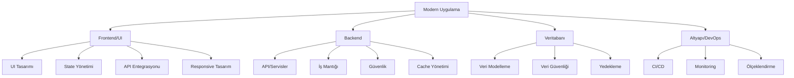

# Flutter'a Giriş

## 1. Yazılım Geliştirici Olma Yolculuğu

### Temel Bilgi ve Beceriler
- **Programlama Temelleri**
  - Algoritma ve mantıksal düşünme
  - Veri yapıları
  - Nesne yönelimli programlama (OOP)
  - Versiyon kontrol sistemleri (Git)
  - Terminal/Komut satırı kullanımı

- **Yazılım Mimarisi**
  - Tasarım desenleri (Design Patterns)
  - SOLID prensipleri
  - Clean Code yaklaşımı
  - Yazılım yaşam döngüsü

- **Veritabanı Bilgisi**
  - İlişkisel veritabanları (SQL)
  - NoSQL veritabanları
  - Temel sorgu yazma
  - Veritabanı tasarımı

### Modern Bir Uygulamanın Anatomisi



### Frontend Geliştirici için Gereksinimler
1. **Temel Teknolojiler**
   - HTML, CSS, JavaScript
   - UI/UX prensipleri
   - Responsive tasarım
   - State yönetimi

2. **Modern Frontend Araçları**
   - Framework bilgisi (Flutter, React, Vue vb.)
   - Paket yöneticileri
   - Build araçları
   - Test yazma

3. **Performans ve Optimizasyon**
   - Lazy loading
   - Caching stratejileri
   - Asset optimizasyonu
   - Memory management

### Backend Entegrasyonu
1. **API Mimarisi**
   - REST API prensipleri
   - GraphQL
   - WebSocket
   - Authentication/Authorization

2. **Veri İşleme**
   - CRUD operasyonları
   - Veri formatları (JSON, XML)
   - Error handling
   - Logging ve monitoring

3. **Güvenlik**
   - SSL/TLS
   - Token bazlı güvenlik
   - Veri şifreleme
   - Input validasyonu

### Modern Uygulama Geliştirme Süreçleri
1. **Proje Yönetimi**
   - Agile metodolojiler
   - Sprint planlama
   - Code review süreçleri
   - Dokümantasyon

2. **DevOps Pratikleri**
   - CI/CD pipeline
   - Konteynerizasyon (Docker)
   - Cloud servisleri
   - Monitoring ve logging

3. **Test ve Kalite**
   - Unit testing
   - Integration testing
   - UI testing
   - Performance testing

## 2. Flutter Nedir ve Kurulum

### Flutter Nedir?
Flutter, Google tarafından geliştirilen açık kaynaklı bir UI yazılım geliştirme kitidir. Tek bir kod tabanından iOS, Android, web, Windows, macOS ve Linux için uygulama geliştirmenize olanak sağlar. Flutter'ın öne çıkan özellikleri:

- Hızlı geliştirme (Hot Reload özelliği)
- Zengin widget kütüphanesi
- Yüksek performans
- Özelleştirilebilir tasarım
- Geniş topluluk desteği

### Gerekli Araçların Kurulumu

#### 1. Flutter SDK Kurulumu
```bash
# Linux için kurulum adımları
cd ~/development
tar xf ~/Downloads/flutter_linux_3.x.x-stable.tar.xz
export PATH="$PATH:`pwd`/flutter/bin"
```

#### 2. Dart SDK
Flutter SDK ile birlikte otomatik olarak gelir.

#### 3. IDE Kurulumu
**VS Code için:**
1. VS Code'u yükleyin
2. Flutter ve Dart eklentilerini kurun
3. Flutter Doctor komutunu çalıştırın

**Android Studio için:**
1. Android Studio'yu yükleyin
2. Flutter ve Dart pluginlerini kurun
3. Android SDK'yı yapılandırın

#### 4. Platform Araçları
**Android için:**
- Android SDK
- Android Studio veya Command-line tools
- Android Emulator

**iOS için (macOS gereklidir):**
- Xcode
- iOS Simulator
- CocoaPods

### Yapılandırma ve Doğrulama

Kurulumun başarılı olduğunu doğrulamak için terminal'de şu komutu çalıştırın:
```bash
flutter doctor
```

Bu komut, eksik bileşenleri ve yapılandırma sorunlarını gösterecektir.

### İlk Projeyi Oluşturma
```bash
flutter create ilk_uygulama
cd ilk_uygulama
flutter run
```

### Önerilen VS Code Eklentileri
- Flutter
- Dart
- Flutter Widget Snippets
- Awesome Flutter Snippets
- Flutter Tree
- pubspec Assist

Bu kurulum ve yapılandırma adımlarını tamamladıktan sonra Flutter ile uygulama geliştirmeye başlayabilirsiniz. 
